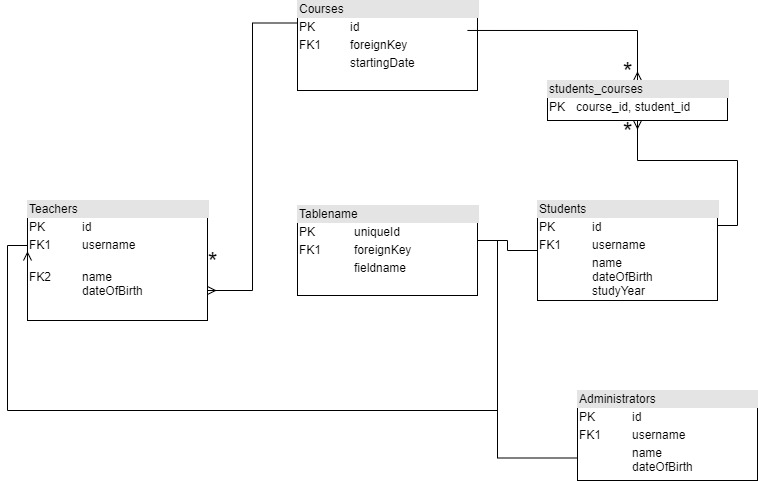
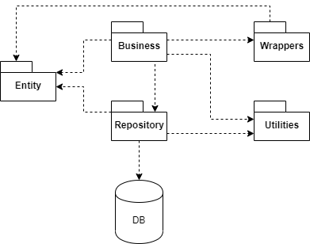
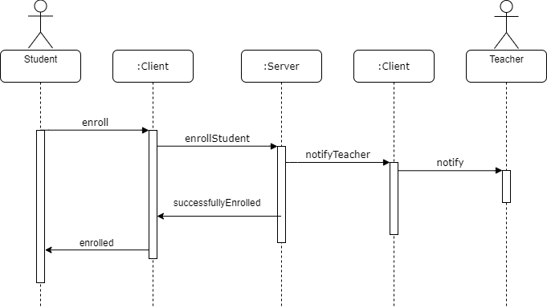

# Problema
In contextul avansului tehnologic masiv din ultimul secol care a persmis o mai buna analizare si intelegere a modului de functionare al oamenilor, au aparut noi modalitati de invatare. Gamificarea, este una din aceste metode de predare-învățare mai si promite a fi mai eficientă si deosebit de valoroasă pentru profesorii care doresc să promoveze învățarea prin jocuri și crearea prin jocuri în sălile de clasă. Jocul în sala de clasă este un instrument eficient pentru învățare și o cale de rezolvare a problemelor abordate printr-o atitudine jucăușă, încurajează elevii și conduce la o învățare mai profundă, ajută la dezvoltarea unor abilități necunoscute de către ei, spiritul și atitudinea acestora sunt descătușate, astfel că jocul facilitează înțelegerea și gândirea divergentă.
##### Avantajele Gamificarii 
 - Face procesul de invatare interactiv și distractiv
 - Îmbunătățește absorbția de cunoștințe și capacitatea de a le reține
 - Creșterea angajamentului elevului
 - Libertatea de a eșua fără consecințe negative și oportunitatea de a încerca din nou

Datorita deschiderii spre tehnologie si in general spre nou al tinerilor si in special al celor din domeniul IT, o prima iteratie a introducerii gamificarii in educatie o poate reprezenta crearea unui soft educational care sa permita studentilor un proces educational ce beneficiaza de toate avantajele prezentate mai sus. Acest soft ar trebui sa poata elimina acele procese greoi si neatractive precum evaluarea studentilor printr-un process ce implica scrierea de cod pe foaie, calculul activitatii semestriale pe baza unor teste punctuale si nu pe urmarirea efortului, timpului si progresului facut de catre student si incurajarea individualitatii si necooperarii de frica copierii temelor.

# Solutia aleasa
Complexitatea problemei este una ridicata, iar procesul educational trebuie rafinat si adaptat de la o generatie la alta. Din acest motiv, solutia aleasa este una care sa permita cadrului didactic o flexibilitate cat mai mare, dar in acelasi timp sa poata realiza automat evaluarea, ghidarea si centralizarea rezultatelor studentilor. 
Aplicatia va permite profesorului sa creeze un curs in care sa poata adauga studentii, sa creeze sarcini pe care studentii trebuie sa le rezolve, dar si sa stabileasca indicatii pentru greselile tipice pe care studentii le pot realiza. De asemenea, acesta va putea lansa competitii sau provocari ce presupun rezolvarea unei probleme mai dificile pentru a stimula studentii, iar un clasament ce contine diferiti parametrii va fi afisat.
Studentul va fi inscris in cadrul mai multor cursuri si va putea sa isi testeze si imbunatateasca solutiile din cadrul sarcinilor lasate de catre profesor, primind indicatii cand greseste. In acest fel, i se ofera oportunitatea sa greseasca fara a avea consecinte negative. Pentru stimulare, se pot oferii si premii sub forma de badge-uri care sa ateste diferite reusite ale acestuia.
Functionalitati-le de mai sus vor fi implementate utilizand android ca interfata cu utilizatorul, urmand ca backend-ul sa foloseasca librarii din java pentru o implementare solida si rapida. Conectarea si interactiunea cu baza de date MySQL se va face cu ajutorul ORM-ului Hibernate, iar legatura cu interfata grafica prin intermediul Spring.

# Implementare

## Baza de date
Interactiunea cu baza de date este realizata prin intermediul ORM-ului Hibernate. Aceasta este alcatuita din sase tabele: accounts, administrators, courses, students, students_courses and teachers. Relatiile dintre tabele, precum si campurile acestora pot fi vazute in cadrul diagramei de mai jos.

## Structura aplicatiei
Aplicatia este structurata pe baza arhitecturii BLL continand urmatoarele pachete:
  - Business unde se afla logica aplicatiei
  - Repository responsabila pentru operatiile CRUD cu baza de date
  - Entity ce contine modelele utilizate de aplicatie
  - Wrappers unde se afla wrapperele necesare comunicarii prin intermediul spring cu clientii
  - Utilities ce cuprinde constantele, validatorii si metode statice utilizate de logica aplicatiei

##### Diagrama pe pachete a aplicatiei

##### Design Patterns
Legatura intre layer-ul de business si cel de repository s-a realizat prin intermediul design pattern-ului ***Facade*** care ofera posibilitatea inlocuirii operatiilor de acces la baza de date utilizand alte tehnologii. Acestea din urma trebuie doar sa implementeze interfetele corespunzatoare, asigurând astfel implementarea acelorași funcționalități.

În același timp, ne-am dori ca aplicația sa notifice profesorul când un student s-a înregistrat cu succes în cadrul cursului pe care acesta îl predă. Această funcționalitate a fost implementată utilizand design pattern-ul ***Observer***. La crearea cursului, profesorul este adăugat în lista de observatori a acelui curs și urmează a fi anunțat la înrolarea fiecărui student.

Existența a trei tipuri de conturi în cadrul aplicației: *Administrator*, *Profesor* si *Student*, duce la încărcarea și îngreunarea logicii de business a aplicației. Pentru a elimina această logică suplimentară, am introdus utilizând design pattern-ul ***Factory*** o metodă in cadrul clasei Utils din pachetul Utilities care se ocupă de crearea obiectului potrivit. Această metodă primește ca argumente datele personale ale posesorului contului: nume, data nașterii si account-ul aferent, plus o variabilă care menționează tipul obiectului ce dorește a fi creat. Rezultatul returnat este obiectul dorit! 

##### Diagrama de secventa
Mai jos se găsește diagrama de secvență pentru procesul de înrolare a unui student:

## Lista Endpoint-uri disponibile

1. attemptLogin - primind ca parametrii username-ul si parola verifica disponibilitatea contului in baza de date si returneaza obiectul aferent acestuia in cazul in care exista
2. addCourse - primind ca parametrii profesorul care introduce cursul, id-ul, parola si numele cursului, data de start si data de final si returneaza obiectul nou creat in cazul in care toate datele sunt valide si nu mai exista un alt curs cu acelasi id
3. enrollStudent - primind ca parametrii id-ul studentului si id-ul si parola cursului, realizeaza inscrierea studentului la curs si returneaza un MessageBundle ce cuprinde un mesaj si cursul in caz de succes
4. addUser - primind ca parametrii username-ul si parola alese de administrator, numele si data nasterii utilizatorului, respectiv tipul contului, introduce un nou utilizator in baza de date. Acesta returneaza un MessageBundle continand un mesaj si utilizatorul nou creat in caz de succes.
5. removeUser - primind ca parametru username-ul, sterge utilizatorul din baza de date
6. listAllUsers - returneaza lista cu toti utilizatorii din baza de date

# Manual de utilizare

1. Se lanseaza in executie aplicatia utilizand metoda main din clasa EduApplication
2. Se deschide "login.html" din cadrul proiectului edu_webclient
3. Utilizatorul se logheaza utilizand credentialele, iar la apasarea butonului de login, acesta este redirectionat catre pagina aferenta tipului contului sau
4. 4a.  Utilizatorul (Studentul) se poate inrola la un anumit curs utilizand id-ul si parola acestuia
   4b. Utilizatorul (Profesorul) poate crea un nou curs prin introducerea id-ului, parolei si numele cursului, dar si data de inceput si cea de final a acestuia
   4c. Utilizatorul (Administratorul) poate selecta din meniul aflat in partea de dreapta sus a ecranului sa:
        - Adauge un nou utilizator prin alegerea username-ului si parolei contului, introducand apoi si numele, data de nastere, respectiv tipul contului 
        - Sa stearga un utilizator pe baza username-ului acestuia
        - Sa vizualizeze lista tututor userilor existenti
5. In final, utilizatorul poate reveni la ecranul principal de login prin selectarea optiunii "Sign Out" din coltul dreapta sus a ecranului

# Concluzii 

Proiectul implementeaza in momentul prezent acele functionalitati ce creaza baza unei dezvoltari ulterioare fiind proiectat incat sa permita o scalare usoare si rapida a aplicatiei, dar si o mentenanta usoara. Structura aplicatiei si numeroasele design pattern-uri folosite permit flexibilitate in schimbarea partilor componente ale aplicatiei si inlocuirea lor cu noi tehnologii acolo unde este cazul fara a produce schimbari majore.
Desigur, aceasta varianta permite multe imbunatatiri precum:
- extinderea clientilor pe mai multe platforme
- profesorii sa poata crea asssignment-uri pentru studentii din cadrul unui curs
- profesorii sa poata vedea lista tuturor studentilor
- studentii sa primeasca notificari cand un nou assignment este introdus
- studentii sa poata sa vada toate assignmenturile terminate, dar si o lista cu cele care sunt inca active
- studentii sa poata sa fie notati de catre profesori pentru assignmenturi